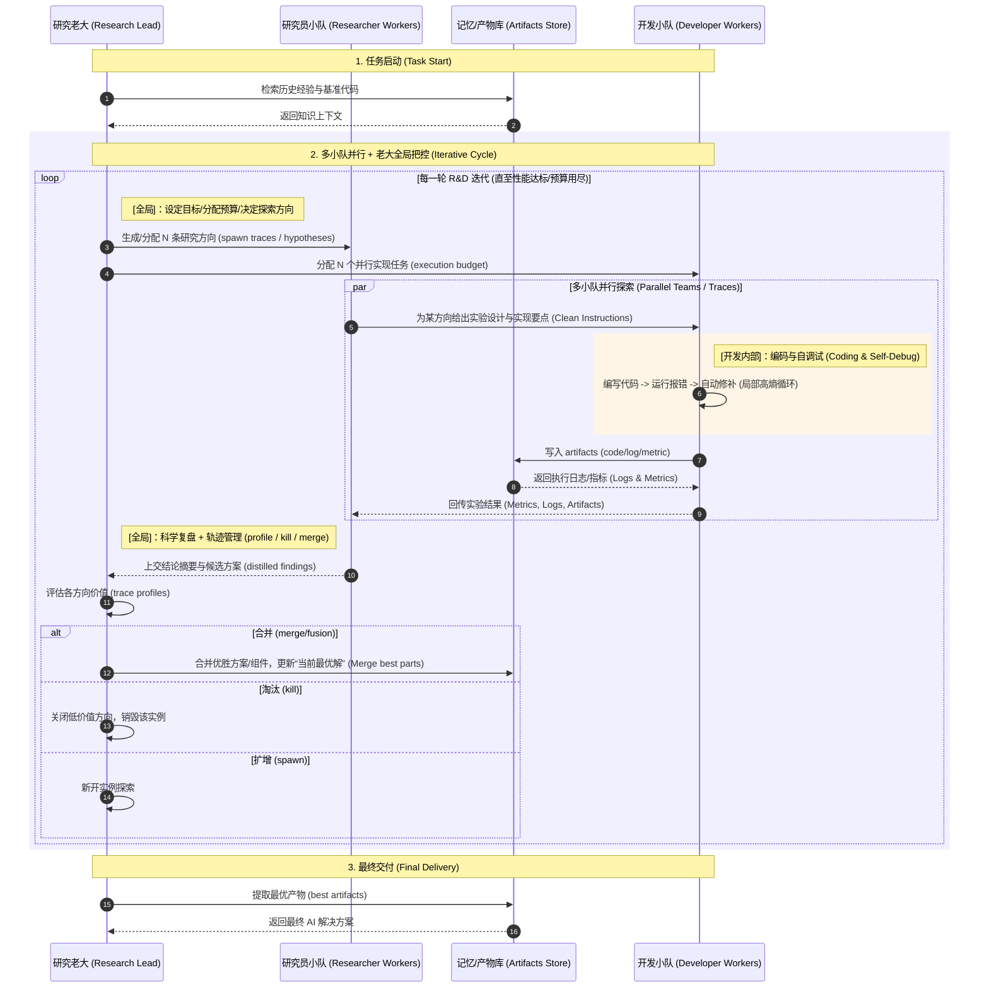

论文阅读笔记：R&D-Agent: An LLM-Agent Framework Towards Autonomous Data Science

2026-01-19 17:58:04 Monday

## 0. 基本信息 & 价值定位

* **标题**：R&D-Agent: An LLM-Agent Framework Towards Autonomous Data Science
* **作者/单位**：HKUST (香港科技大学) / Microsoft
* **年份/会议**：20251001
* **论文链接**：[https://arxiv.org/abs/2505.14738](https://arxiv.org/abs/2505.14738)
* **依赖模型/系统假设**：推理大模型 (如 GPT-4o, o1) 作为大脑，具备代码执行环境的安全沙箱。
* **文章引用量**：新发表 (v2 版近期更新)
* **影响力判断**：
* [ ] 一次性 Idea
* [ ] 关键工程设计
* [x] 可复用工程范式（为 MLE-Agent 领域确立了“研、发分离”的标准架构）

* **一句话价值判断**：通过将数据科学任务拆解为“研究阶段”与“开发阶段”，并引入 6 个标准化组件，解决了 LLM 在长程复杂工程任务中容易“跑偏”和“失忆”的问题。

---

## 1. 一句话工程总结

* **我的总结**：如果我在做 **自动化机器学习/数据科学系统**，这篇论文告诉我：必须把 **“逻辑推理”与“代码实现”彻底解耦**，并建立显式的 **“科研复盘（Reasoning）”到“经验存储（Memory）”的反馈环**，否则会在 **面对长链路、高难度竞赛任务（如 MLE-Bench）时** 因错误累积和无效尝试导致系统崩溃。

---

## 2. 工程前状态：不用这篇论文，我会怎么做？

### 2.1 朴素工程方案

* **直觉实现**：写一个复杂的 System Prompt 告诉模型“你是数据科学家”，然后在一个多轮对话中让它不断写代码、运行、根据报错修改代码，直到跑通为止。即 提出方案 → 写代码 → 运行 → 报错修复 → 再调参 → 再跑
* **可用的情况**：小数据集 / 简单 baseline / 有明确模板任务时可跑出结果，但很难冲到高分。

### 2.2 失控点（Crucial）

* **触发条件**：
    - 数据量大、训练慢、反馈滞后
    - 需要大量试错（特征/模型/后处理组合）
    - 环境错误频繁（依赖、OOM、数据 schema）

* **错误传导**：
    - 代码跑不起来 → agent 反复修 bug → 研究探索被阻断
    - 只优化一个解 → 很快陷入局部最优 → 无法形成“组合式创新”

* **📌 工程定位**：问题的本质是 “上下文管理的失熵”（噪声掩盖，复读机效应）。如果不对“研究逻辑”和“工程执行”进行物理隔离，长链路下的上下文会迅速堆满噪声，导致 Agent 从“科学家”退化成“只会修 Bug 的打字员”。

---

## 3. 作者的观点/发现

* **观点 1**：机器学习工程（MLE）本质上是科学实验，必须有明确的 **假设生成-验证-复盘** 循环。
* **观点 2**：研究逻辑（High-level Reasoning）和代码编写（Low-level Coding）对模型能力的要求不同，分开处理效果更优。
* **发现 1**：在 MLE-Bench 等高难榜单上，单纯靠模型“自纠错”无法提升性能，必须引入 **显式的探索路径管理（Path Structuring）** 来跳出局部最优解。

---

## 4. 作者提出的方法

> **双阶段、六组件架构（R&D-Agent）**：不是线性流水线，而是围绕反馈的**交替迭代闭环**。

1. **研究阶段（Research Phase）**：基于 *performance feedback* 做“下一步探索决策”

   * **Planning**：设定目标与总体策略
   * **Exploration Path Structuring**：组织/管理多条探索路径（multi-trace 并行）
   * **Scientific Reasoning Pipeline**：对结果做因果归因（为什么涨/为什么掉），产出可执行的改进假设
   * **Memory Context**：沉淀有效 insight/方案，压缩噪声上下文

2. **开发阶段（Development Phase）**：基于 *error feedback* 把假设变成可运行实现

   * **Coding Workflow**：实现研究指令 + 自动 debug，保证 runnable
   * **Evaluation Strategy**：在可控成本下评估（如 sampled→full），输出量化指标供研究复盘

**运行方式（关键一句）**：多个 **(Researcher+Developer)** 实例并行探索，不断 **Research ↔ Development** 交替迭代，并在过程中通过跨实例融合（merge）形成更强解。

图解如下：

## 5. 实验：证明作者的观点

### 实验 1：端到端对比（MLE-Bench 主实验）

* **实验目的**：验证 R&D-Agent 整体架构在真实、长程数据科学任务上的健壮性。
* **实验做法**：在 **MLE-Bench**（75 个 Kaggle 任务）上对比 R&D-Agent 与 AIDE 等强 Baseline。
* **实验现象**：R&D-Agent 达到 **Any Medal Rate**；在长链路、高难度任务中，Baseline 常因上下文污染导致逻辑早衰，而 R&D-Agent 性能保持稳定。
* **实验结论**：结构化的“双阶段六组件”架构通过**物理隔离工程噪声**，确保了在复杂工程场景下的端到端交付能力。

### 实验 2：多轨迹并行探索与融合机制验证

* **实验目的**：验证 **Artifact Fusion（产物融合）** 是否优于单纯的“并行赛马”。
* **实验做法**：对比 Single-trace、Best-of-N 以及 **Artifact Fusion**（跨轨迹提取优胜代码片段并合并）。
* **实验现象**：**Fusion 模式显著优于 Best-of-N**。即便单条轨迹得分不高，但“全局协调者”通过杂交 A 轨的特征工程与 B 轨的模型策略，合成了远超单轨上限的最优解。
* **实验结论**：多轨迹融合不仅是扩大搜索空间，更是实现了**组合式创新**，是系统突破局部最优的核心。

### 实验 3：异构模型分工验证

* **实验目的**：验证“强推理模型（Research）+ 强执行模型（Dev）”的配置收益。
* **实验做法**：使用 **o1-preview** 担任 Research Lead，搭配指令遵循能力强的模型担任 Developer。
* **实验现象**：异构配置在保持高性能的同时显著降低了系统性崩溃的概率，体现出“分工明确、术业专攻”的协同优势。
* **实验结论**：R&D 分工是一种**算力层级化管理**的系统结构，能够针对不同性质的任务（逻辑决策 vs 代码实现）匹配最合适的模型能力。

## 6. 工程复用性评估

* **✅ 可直接迁移**：将系统拆分为“决策层”和“执行层”的思想；引入“科研日记（Memory Context）”来过滤无效尝试。
* **⚠️ 隐性成本**：**Token 消耗显著增加**（为了推理和复盘），同时需要稳定的异步执行环境来支撑多路径并行。

---

## 7. 深度理解：为什么它有效？

* **解决的失控类型**：解决了 **“逻辑与工程的耦合崩塌”**。
* **本质机制**：**引入约束与延迟决策**。它强迫模型在写下一行代码前先进行 Reasoning，并将结果存入 Memory。这相当于给 Agent 装上了一个“科研日志本”，减少了无目的的随机尝试。
* **为何换强模型解决不了**：即便用 o1 这种强模型，如果没有 Memory 记录已尝试过的错误路径，模型仍会在长对话窗口中因“注意力漂移”而重复犯错。

---

## 8. 局限性与失效条件

* **崩塌条件**：如果 Initial Plan（初始规划）存在方向性盲区，或者 Memory 提取的 Insights 是错误的（虚假关联），系统会陷入错误的迭代循环。
* **效能边界**：对于那种“只需微调参数”的极简任务，这套重型框架的响应延迟和 Token 成本性价比极低。

